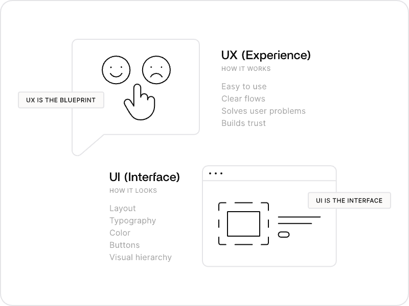
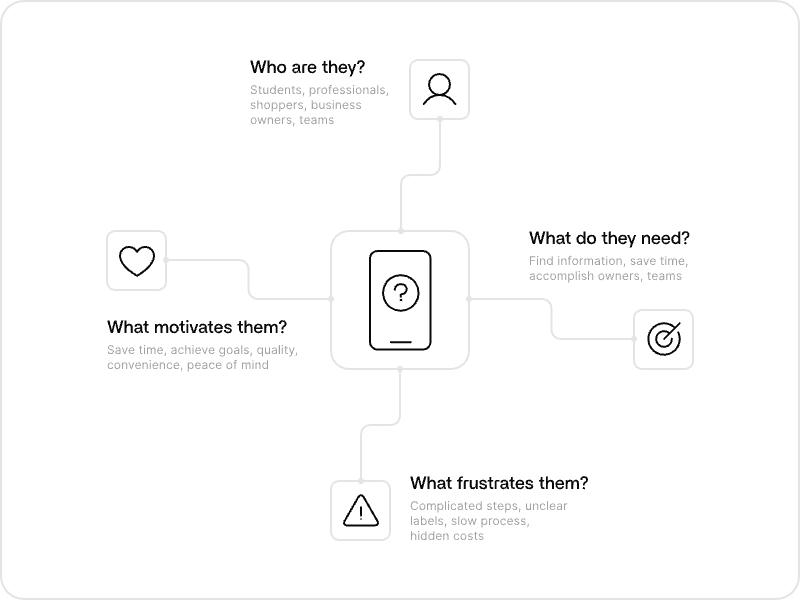
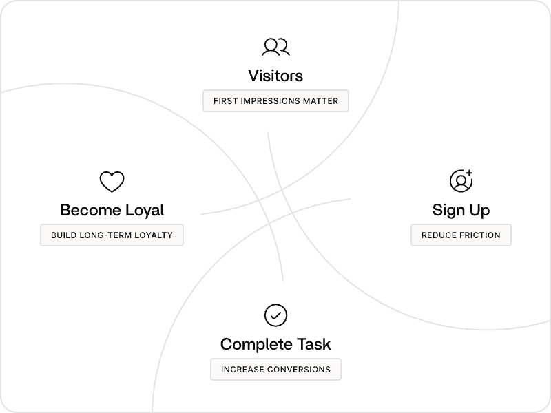
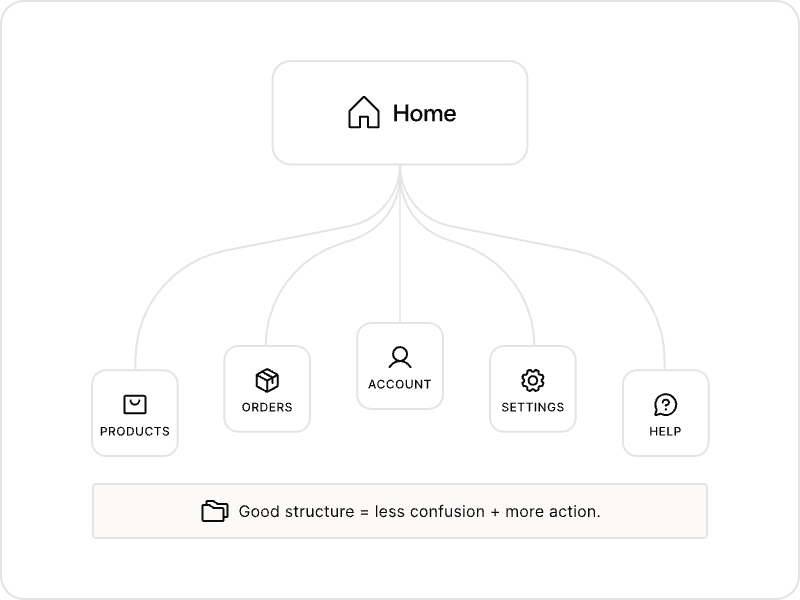
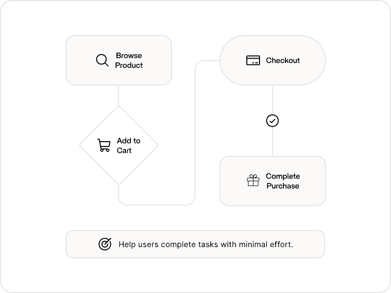
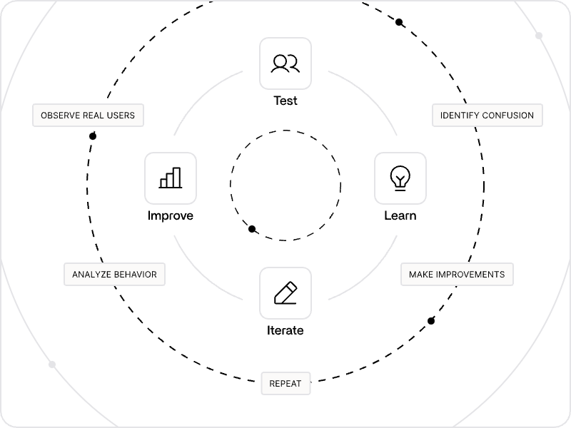
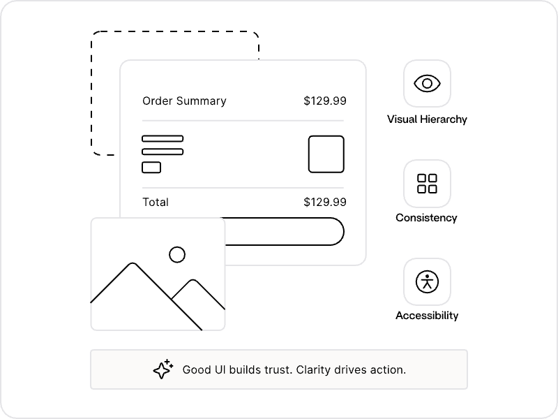

# Lesson 02: Introduction to Product Design

Learn how to decide what to build, who it is for, and why it matters before you write code, design screens, or ship a feature.

You do not need a product design title to make strong product decisions. **Product design** is the discipline of deciding what a product should do, who it serves, and how you will know it worked.

In Lesson 01, you learned how UI/UX helps people use a product successfully. Product design comes before that. It connects user needs, business goals, and technical reality into decisions about what is worth building in the first place.

Think of it this way:

- **Product design** decides that a meal-planning app should help busy parents save time on weeknight dinners.
- **UI/UX design** decides how those parents browse recipes, build a grocery list, and check off steps without getting lost.

You need both mindsets. Shipping quickly or building something technically impressive does not help if you built the wrong thing.

---

## What is Product Design?

Product design is the practice of solving real user problems through thoughtful product decisions.

Before you build, ask:

- What problem are we solving?
- Who experiences this problem?
- Why does solving it matter?
- What should we build first?
- How will we know if it worked?

A product is not just an interface or a codebase. It is the combination of features, flows, messaging, and outcomes that help people accomplish something meaningful.

### Example: A Project Management Tool

Users do not want "more features." They want to finish work on time, stay aligned with their team, and feel less overwhelmed.

Strong product thinking starts with that outcome, then decides which capabilities actually support it. That might mean building fewer things, not more.

**What does product design primarily focus on?**

- Choosing fonts and button colors
- ✓ Deciding what to build, who it is for, and why it matters
- Writing backend infrastructure code
- Adding every feature that seems technically interesting

**Which question should come first when you are building something new?**

- What framework should we use?
- ✓ What problem are we solving and for whom?
- How many tabs should the settings page have?
- Which competitor has the most features?

---

## What to Build vs How It Works

Product thinking and UI/UX work together, but they answer different questions.

| Focus | Product design | UI/UX design |
|-------|----------------|--------------|
| Main question | What should we build? | How should people use it? |
| Typical outputs | Problem statements, feature priorities, success metrics | Flows, wireframes, interfaces, usability improvements |
| Success looks like | Solving the right problem for the right users | Making that solution easy to understand and use |

It is easy to jump straight into implementation. You might start building an auth system, dashboard, or API before asking whether users actually need it, in that form, in that order.

A polished interface cannot fix a product that solves the wrong problem. A strong idea still fails if users cannot figure out how to use it.

**What is the main difference between product design and UI/UX design?**

- ✓ Product design decides what to build; UI/UX design focuses on how people use it
- Product design only applies to hardware products
- UI/UX design happens before any product decisions are made
- They mean the same thing

---

## Start With Problems, Not Features

Strong products begin with problems, not feature lists.

Before adding functionality, try to understand:

- What is hard about the current experience?
- When does the problem happen?
- What have users already tried?
- What would success look like for them?

A clear **problem statement** keeps everyone aligned. It describes who has the problem, what goes wrong today, and why it matters.

### Example: Online Booking

A salon owner might ask for "an app with push notifications and loyalty points." The real problem may be that clients forget appointments and staff spend too much time confirming bookings by phone.

Product thinking reframes the request around the actual user need before you decide what to build.

Teams often receive requests phrased as solutions: "Add a dashboard," "Build an export button," "Support webhooks." The better move is to understand the problem behind the request before treating it as a spec.

**What should you prioritize before adding features?**

- ✓ Understanding the user problem and what success looks like
- Copying every feature competitors offer
- Designing the homepage layout first
- Choosing a technology stack

**Why can a feature list be misleading?**

- ✓ Users often describe solutions, not the underlying problem
- Users always know exactly what they want built
- Feature lists eliminate the need for research
- More features always mean a better product

---

## Outcomes Over Outputs

Features are **outputs**. What users actually want are **outcomes**.

An outcome is the result someone is trying to achieve. A feature is one way the product might help them get there.

### Example: A Fitness App

| Output | Outcome |
|--------|---------|
| Workout tracking | Stay healthy and make progress |
| Streak badges | Build a consistent habit |
| Social sharing | Feel motivated and accountable |

Focus on the job users are trying to get done, then choose features that support that job. This is sometimes called **Jobs to Be Done** thinking: people "hire" products to make progress in their lives.

If a feature does not move users toward a meaningful outcome, it may not belong in the product yet, even if it would be fun or technically satisfying to build.

**What is the difference between an outcome and an output?**

- ✓ An outcome is what the user wants to achieve; an output is a feature or deliverable
- They mean the same thing
- An output is always more important than an outcome
- Outcomes only matter for marketing teams

**Why should you focus on outcomes?**

- ✓ It keeps the product centered on user progress, not feature count
- It eliminates the need to talk to users
- It means every competitor feature should be copied
- It replaces the need for UI/UX design

---

## The Curse of Knowledge

The **curse of knowledge** happens when you know something so well that you forget what it feels like not to know it.

This trap is especially common when you know a product or system deeply. Once you understand how something works, it is easy to assume:

- Labels are obvious
- Steps are self-explanatory
- Technical terms make sense to everyone
- Important actions do not need explanation

Teams who live inside a product every day often build for themselves instead of for new users.

### Example: Account Setup

You might name a field `auth_provider_id`, hide email verification behind abbreviations, or use internal terms like "workspace" without explaining them. To you, everything feels clear. To a first-time user, the product feels confusing from the first minute.

Fight the curse of knowledge by:

- Testing with people who are new to the product
- Using plain language in UI copy, docs, and errors
- Explaining why a step exists, not just what to click
- Questioning assumptions that feel "obvious" because you built the system

**What is the curse of knowledge?**

- A rule that products should never use technical terms
- ✓ Forgetting what it feels like not to know something you know well
- The idea that users always read documentation first
- A visual design principle about color contrast

**How can you reduce the curse of knowledge?**

- ✓ Test with new users and use plain language
- Assume your own understanding represents all users
- Add more internal jargon to sound professional
- Skip onboarding because the product is "simple enough"

---

## Define Success Before You Build

Define success before you commit serious time to implementation.

Ask early:

- What would success look like for users?
- What would success look like for the business or project?
- How will we measure it?

Examples of success metrics:

- Time to complete a first important task
- Signup or activation rate
- Task completion rate
- Retention after the first week
- Support tickets related to a core workflow

If you know what success looks like, you can measure it, track the right signals, and avoid optimizing the wrong thing.

Metrics do not replace empathy. They help you know whether you solved the right problem or just shipped something that looks finished.

**Why define success metrics early?**

- ✓ So you know whether the product actually worked
- So you can skip testing entirely
- So stakeholders can add unlimited scope
- So you can avoid talking to users

**Which of the following is an example of a product success metric?**

- The number of microservices in the backend
- ✓ The rate at which new users complete their first important task
- How many GitHub commits the team made
- The size of the product roadmap

---

## MVP and Prioritization

Not every good idea should be built right now.

An **MVP** (Minimum Viable Product) is the smallest version of a product that lets you test whether you are solving the core problem. It is not an excuse to ship something broken. It is a focused way to learn fast before you overbuild.

When you are building, decide:

- What belongs in the first version
- What can wait
- What creates the most value with the least complexity
- What risks confusing or overwhelming users

This often means saying no to features that sound exciting but do not solve the core problem, including features that are technically interesting but not essential.

### Example: A Budgeting App

The core job might be helping users understand where their money goes each month. Advanced investment tracking, social sharing, and custom categories might be useful later, but they are not the same priority as making expense entry fast and trustworthy.

Good prioritization keeps you focused on the outcome users care about most.

**What is an MVP?**

- A product with every feature stakeholders request
- ✓ The smallest focused version that tests whether the core problem is being solved
- A prototype with only visual polish and no functionality
- The final version of the product after all research is complete

**Why is prioritization important when building a product?**

- ✓ It keeps you focused on the highest-value problems first
- It guarantees every requested feature gets built immediately
- It removes the need to talk to users
- It replaces the need for UI/UX work

---

## Making Product Decisions

Building a product is full of tradeoffs. There is rarely one perfect answer.

Strong decisions connect:

- User needs
- Business or project goals
- Technical constraints
- Evidence from research or usage data

Instead of guessing, treat decisions as **hypotheses**:

- We believe busy parents need a weekly meal plan more than daily recipe inspiration.
- We believe fewer checkout steps will increase completed purchases.
- We believe clearer error messages will reduce support tickets.

Hypotheses can be tested, measured, and revised. That keeps product thinking grounded in reality instead of opinion alone.

This mindset helps you move faster with less guesswork. You can test the smallest version of an idea, measure the result, and learn from it.

**Why use hypotheses when building a product?**

- ✓ To make assumptions testable instead of treating opinions as facts
- To avoid talking to users until launch
- To eliminate the need for metrics
- To speed up decisions by skipping research

**What should guide product decisions?**

- ✓ User needs, goals, constraints, and evidence
- Only what looks best in a mockup
- Whatever seems most technically impressive
- Competitor feature lists alone

---

## Building With Others

Even if you are working alone, product decisions rarely happen in isolation.

You may need to align with:

- **Users or customers** who experience the problem
- **Teammates** who design interfaces, write code, or handle support
- **Stakeholders** who care about business goals, timelines, or scope

Clear communication matters. A problem statement, success metric, and prioritized feature list help everyone build toward the same outcome instead of debating disconnected ideas.

On a team, product thinking helps you push back thoughtfully when a request is vague, ask better clarifying questions, and suggest smaller ways to test an idea before a large build.

**Why does product thinking matter on a team?**

- ✓ Product decisions affect users, design, engineering, and business goals
- Only non-technical teammates should think about users
- Collaboration only matters after launch
- Engineers should never question product scope

---

## Testing Assumptions

Product thinking does not end when you write a roadmap or merge a pull request.

Validate ideas through:

- User interviews
- Prototypes
- Usability testing
- Beta releases
- Metrics such as activation, retention, and task completion

You do not need a large research team to do this. Watch someone use your prototype. Share an early version with five users. Track whether people complete the core workflow.

If users struggle with a core flow, the problem may not be button color. It may be unclear scope, too many steps, missing context, or the wrong feature priority.

Be careful not to confuse positive reactions with real progress. Polished mockups can feel convincing because of the **aesthetic-usability effect**: people often perceive attractive products as easier to use, even when the underlying experience still has problems. Good visual design builds trust, but it cannot replace testing whether users can actually complete important tasks.

### Example: A Food Delivery App

If most users abandon the flow after adding items to their cart, the problem may not be CSS. It may be unexpected fees, unclear delivery timing, or too many decisions at checkout. Product thinking helps you identify which assumption failed.

**How should you treat early product ideas?**

- As final decisions that should not be questioned
- ✓ As assumptions that need testing with real users and data
- As complete once the spec is written
- As UI problems that only designers can fix

**What should you investigate if users abandon a core workflow?**

- ✓ Whether the product scope, steps, or assumptions are creating friction
- Only whether the primary button is the right shade of blue
- Whether users need more features immediately
- Whether the backend needs more optimization

**Why should you test beyond polished mockups?**

- ✓ Attractive designs can feel successful even when users still struggle with core tasks
- Visual polish automatically proves product-market fit
- Users never form opinions from first impressions
- Testing is only useful after launch

---

## Key Takeaway

Product design is about solving the right problem for the right people in a way that creates real value.

Strong product thinking means staying close to user needs, defining success early, prioritizing ruthlessly, and testing assumptions. Clear interfaces matter, but clarity starts long before the first screen or line of code.

Watch for traps like the **curse of knowledge**, where you assume users understand what already feels obvious to you because you built the system.

**What is the ultimate goal of good product design?**

- Building as many features as possible
- ✓ Solving the right user problem in a focused, validated way
- Making the product look identical to competitors
- Avoiding user research to move faster

**Which concept describes assuming others understand what you already know?**

- ✓ The curse of knowledge
- A user flow
- Information Architecture
- An MVP

**What should you define before committing to a large build?**

- ✓ What success looks like and how it will be measured
- Every visual detail in the final interface
- The full feature roadmap for the next two years
- Which competitors to copy first

---

## What's Next

You now understand how product thinking differs from UI/UX, why problem framing and outcomes matter, and how to prioritize, define success, and test assumptions before scaling a build.

The next step is practice: turn vague ideas into clear problem statements, choose a focused first version, and build in a way that helps you learn quickly.

Keep testing assumptions, stay close to users, and remember that good products feel obvious in hindsight because someone did the hard thinking before the build got too big.
