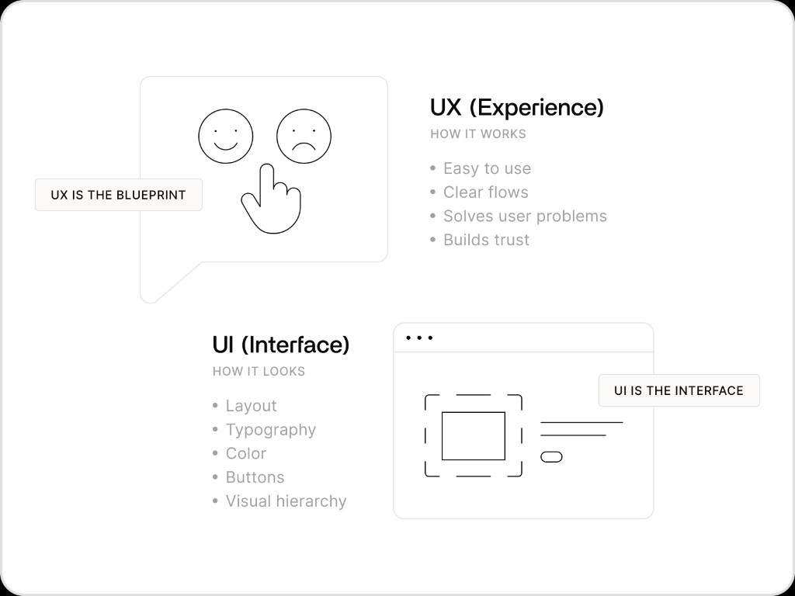
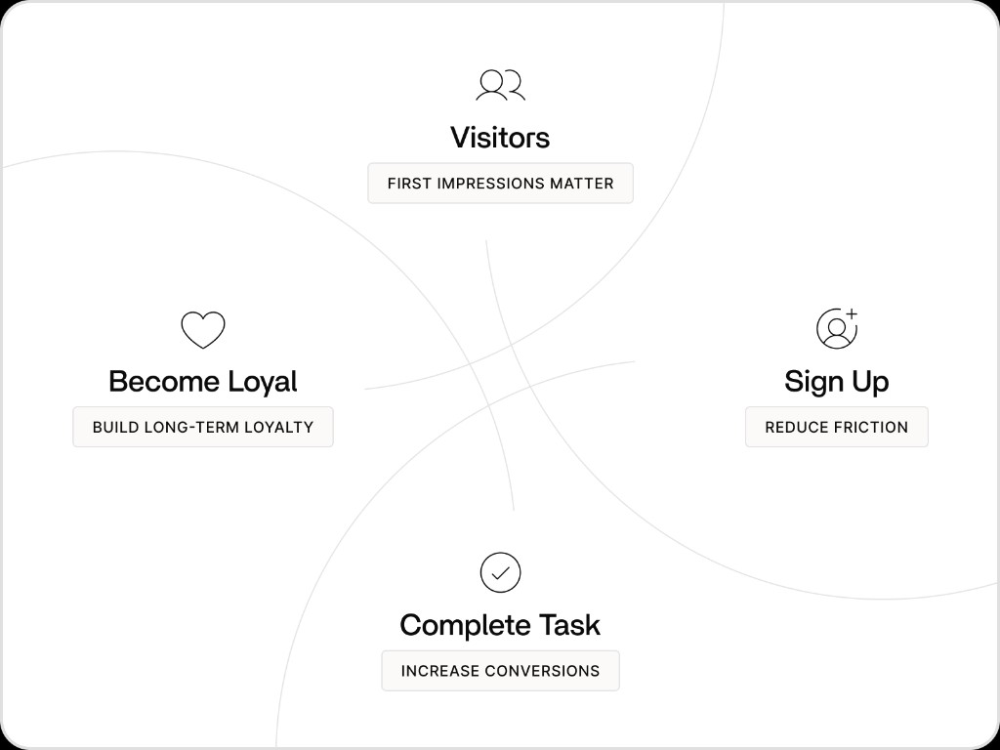
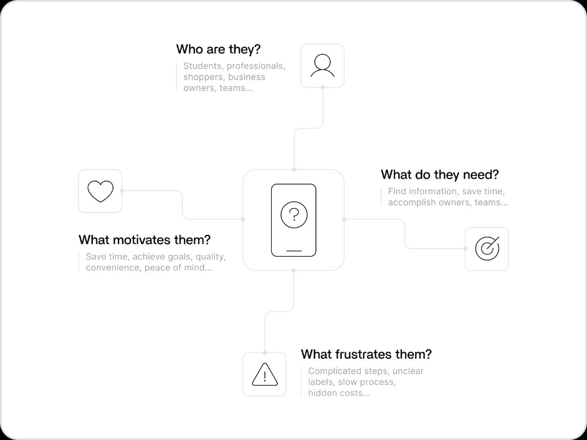
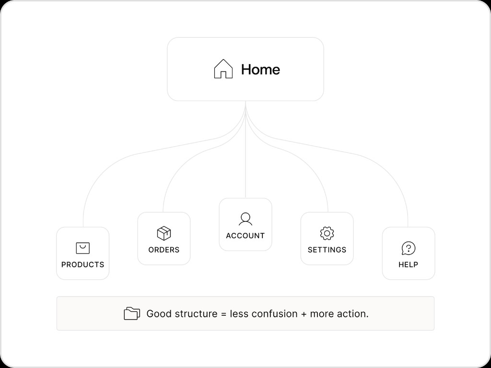
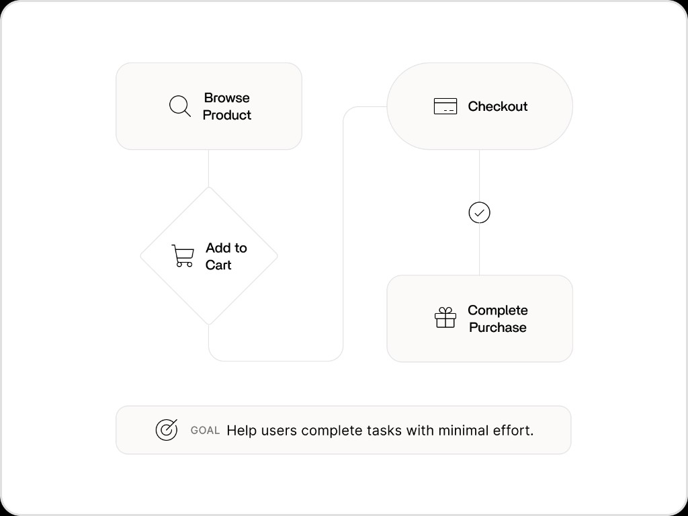
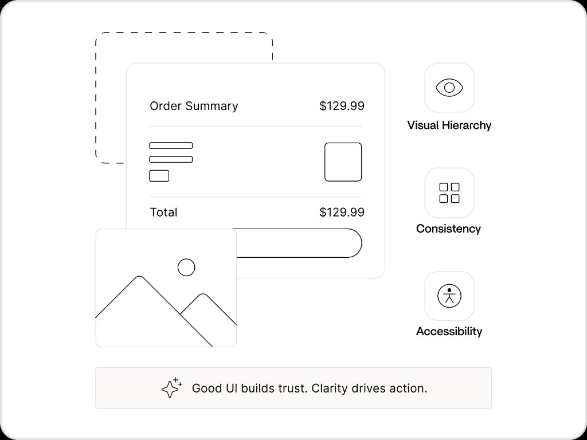

# Lesson 01: Introduction to UI/UX Design

Learn how to design digital products that are useful, easy to use, and help people accomplish their goals with confidence.

Most people use **UI/UX** as a single term, but they're actually two different disciplines. A great digital product needs both. An app can offer powerful features, but if users cannot figure out how to use them, they will leave before discovering its value.

Think of it this way:

- **UX** is the process of ordering food through a delivery app.
- **UI** is the screen that helps you browse restaurants and place an order.

---

## What is UI/UX Design?

### User Experience (UX)

User Experience focuses on how a product works.

Questions UX designers ask:

- Is it easy to create an account?
- Can users complete important tasks successfully?
- Does the experience feel intuitive?

### User Interface (UI)

User Interface focuses on how a product looks and communicates.

Examples include:

- Layout
- Typography
- Color
- Buttons
- Visual hierarchy

**What is the difference between UI and UX?**

- UX is how a product looks; UI is how it works
- ✓ UX is how a product works; UI is how it looks and communicates
- They mean the same thing
- UI only applies to mobile apps

**What does UX design primarily focus on?**

- How a product looks and communicates
- ✓ How a product works and feels to use
- Writing backend code
- Choosing brand colors and fonts

**Which of the following is an example of UI design?**

- Mapping a checkout flow
- ✓ Choosing typography and button layout
- Identifying friction in a signup flow
- Testing whether users understand a new feature

---

## Why UI/UX Matters

Users form opinions quickly. If a product feels confusing or difficult to use, many users leave before discovering its value.

Good UI/UX helps:

- Increase conversions
- Improve customer satisfaction
- Reduce support requests
- Build trust
- Increase retention

Successful products succeed because users can accomplish goals with confidence.

**Why do many users leave a confusing product before discovering its value?**

- ✓ They form opinions quickly when a product feels difficult to use
- They always read the documentation first
- Good design only matters for mobile apps
- Users prefer products with more features, even if they are hard to use

---

## Understanding Users

UI/UX design starts with people, not screens.

Before designing anything, designers ask:

- Who are the users?
- What problem are they trying to solve?
- What motivations do they have?
- What frustrations do they have?

### Example: Fitness Apps

A fitness app is not really about tracking workouts.

It is about helping users stay healthy and make progress.

Good UX designers focus on user goals rather than product features.

Users care about outcomes. They do not care about how many backend systems power the experience behind the scenes.

**What should designers focus on first?**

- Product features and technical architecture
- ✓ User goals and the problems they are trying to solve
- Visual trends in other apps
- The number of integrations a product supports

---

## Information Architecture

Before designing visuals, designers organize information.

**Information Architecture (IA)** is how content and functionality are structured.

Examples include:

- Navigation menus
- Dashboard organization
- Product categories
- Checkout flows
- User journeys

Questions designers ask:

- Where should users start?
- What comes next?
- How many steps does this take?
- Does the terminology make sense?

A well-organized product feels effortless.

Users should never feel lost.

**What is Information Architecture?**

- The visual styling of buttons and typography
- ✓ How content and functionality are structured in a product
- The process of writing product documentation
- A method for choosing brand colors

**What practice do designers use to organize content and functionality before designing visuals?**

- ✓ Information Architecture
- Visual hierarchy
- User interface styling
- Backend documentation

---

## Designing User Flows

A user flow is the path someone takes to complete a task.

Examples include:

- Creating an account
- Purchasing a product
- Booking an appointment
- Resetting a password

Designers map these journeys to identify:

- Friction points
- Confusing steps
- Opportunities to simplify

The goal is to help users reach their destination with as little effort and confusion as possible.

Every extra step introduces friction.

**What is a user flow?**

- The color palette used across an app
- ✓ The path someone takes to complete a task
- The backend architecture of a product
- A list of all product features

**Why does every extra step in a flow matter?**

- ✓ It introduces friction and increases the chance users abandon the task
- It makes the product look more professional
- It reduces server costs
- It is required for good visual hierarchy

---

## Creating the Interface

Once the experience is planned, designers create the interface.

### Visual Hierarchy

Important elements should stand out.

Users should immediately know:

- What they can do
- What matters most
- Where to click

The most important information should be impossible to miss.

### Consistency

Buttons, colors, spacing, and patterns should behave predictably.

For example:

- Primary buttons should always look the same
- Success states should always feel familiar
- Confirmation patterns should follow consistent rules

Consistency reduces learning time.

### Accessibility

Products should work for everyone through readable text, sufficient contrast, clear labels, keyboard navigation, and screen reader support.

Good accessibility improves usability for everyone.

**Why is consistency important in UI design?**

- ✓ It reduces learning time and makes interactions feel predictable
- It makes every page look completely different
- It eliminates the need for user testing
- It replaces the need for clear visual hierarchy

**Which of the following is an accessibility consideration?**

- ✓ Using sufficient color contrast and clear labels
- Adding as many features as possible to one screen
- Hiding navigation to reduce clutter
- Using the smallest text size that fits the layout

---

## Testing and Iteration

Design is rarely perfect on the first attempt.

Designers test their work by observing real users.

Common questions include:

- Can users complete important tasks?
- Where do users get stuck?
- What confuses them?

Feedback helps improve the product through multiple iterations.

### Example

If users repeatedly abandon a checkout flow at the payment step, the design may need clearer messaging or a simpler layout.

The best designers treat design as an ongoing process rather than a final deliverable.

**What should you do if users repeatedly abandon a flow at the same step?**

- Ignore it because that step is always confusing
- ✓ Redesign with clearer messaging or a simpler layout
- Remove the step entirely without testing
- Add more technical jargon to the page

**How should designers treat the design process?**

- As a one-time final deliverable
- ✓ As an ongoing process of testing and iteration
- As something only engineers should handle
- As complete once the mockups are approved

---

## Key Takeaway

UI/UX design is the practice of creating products that are both useful and easy to use.

Great design helps people achieve their goals confidently and efficiently. When users can complete tasks without confusion, good design becomes almost invisible.

**What is the ultimate goal of good UI/UX?**

- Making products look trendy with industry jargon
- ✓ Helping people achieve their goals confidently and efficiently
- Showing off how many features a product has
- Making users think about the technology behind every action

**What do you call the path someone takes to complete a task?**

- ✓ A user flow
- A user interface
- A wireframe
- A design system

---

## What's Next

You now understand what UI and UX are, why they matter, and how to think about users, structure, flows, interfaces, and iteration. That is a strong foundation for designing any digital product.

But knowing how to design clear screens is not the same as knowing how to design a product. Interfaces explain how something works. Product design decides what gets built, who it is for, and why it matters.

In the next lesson, continue with [`Introduction to Product Design`](introduction-to-product-design.md): defining user problems, shaping features, and making design decisions that go beyond screens and flows.
