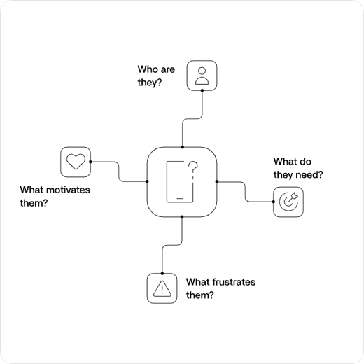
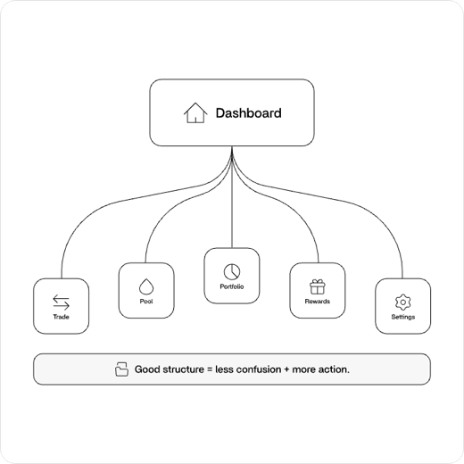
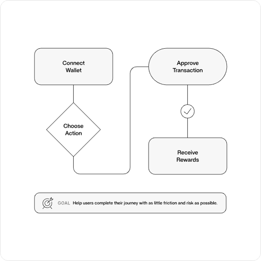
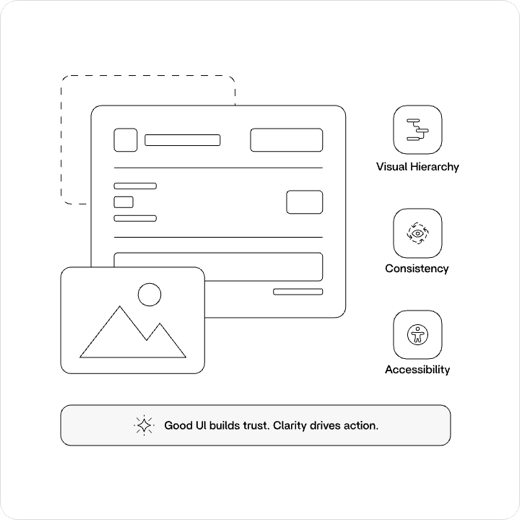
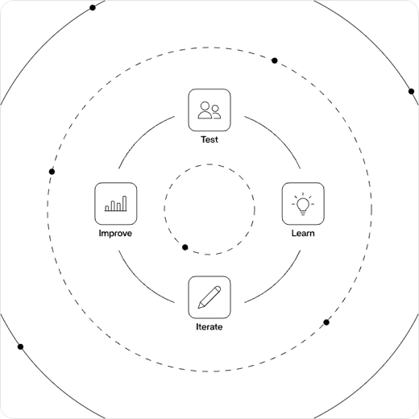

# Introduction to UI/UX Design for Web3

Learn how to design Web3 products that users trust, understand, and actually use.

Most people use **UI/UX** as a single term, but they're actually two different disciplines. A great Web3 product needs both. A protocol can offer the highest yields in the market, but if users don't understand how to deposit assets safely, they'll leave.

Think of it this way:

- **UX** is the process of swapping tokens.
- **UI** is the screen that helps you understand and complete that swap.

---

## What is UI/UX Design?

### User Experience (UX)

User Experience focuses on how a product works.

Questions UX designers ask:

- Is it easy to connect a wallet?
- Can users complete a swap or deposit successfully?
- Do transaction states make sense?
- Does the experience feel intuitive?

### User Interface (UI)

User Interface focuses on how a product looks and communicates.

Examples include:

- Layout
- Typography
- Color
- Wallet buttons
- Visual hierarchy

**What is the difference between UI and UX?**

- UX is how a product looks; UI is how it works
- UX is how a product works; UI is how it looks and communicates
- They mean the same thing in Web3
- UI only applies to mobile apps

**What does UX design primarily focus on?**

- How a product looks and communicates
- How a product works and feels to use
- Writing smart contract code
- Choosing brand colors and fonts

**Which of the following is an example of UI design?**

- Mapping a wallet connection flow
- Choosing typography and button layout
- Identifying friction in a deposit flow
- Testing whether users understand transaction approvals

---

## Why UI/UX Matters

Users form opinions quickly.

In Web3, that judgment happens even faster because users are dealing with real money.

If a product feels confusing or unsafe, users won't connect their wallet—even if the underlying technology is excellent.

Good UI/UX helps:

- Increase wallet connections
- Improve conversion rates
- Reduce support requests
- Build trust
- Increase retention

Successful products like **Uniswap**, **Phantom**, **Coinbase**, and **Jupiter** aren't successful solely because of their technology.

They're successful because users can understand and complete complex actions with confidence.

Trust is one of the most important design goals in Web3.

**Why is trust especially important in Web3 UI/UX?**

- Users are dealing with real money and irreversible transactions
- Web3 apps don't need good design because the technology speaks for itself
- Users always read the smart contract code before connecting
- Trust only matters for institutional investors

---

## Understanding Users

UI/UX design starts with people, not screens.

Before designing anything, designers ask:

- Who are the users?
- What problem are they trying to solve?
- What motivates them?
- What frustrations do they have?

### Example: Yield Farming

A yield farming platform isn't really about staking.

It's about helping users answer:

> How can I earn more on my assets without taking unnecessary risk?

### Example: Trading Platforms

A trading platform isn't really about charts.

It's about helping users answer:

> How can I make confident trading decisions?

Good UX designers focus on user goals rather than protocol features.

Users care about outcomes.

They don't care about how many smart contracts are involved behind the scenes.

**What should designers focus on first?**

- Protocol features and smart contract architecture
- User goals and the problems they're trying to solve
- Visual trends in other crypto apps
- The number of integrations a product supports

---

## Information Architecture

Before designing visuals, designers organize information.

**Information Architecture (IA)** is how content and functionality are structured.

Examples include:

- Navigation menus
- Dashboard organization
- Portfolio pages
- Deposit flows
- User journeys

Questions designers ask:

- Where should users start?
- What comes next?
- How many steps does this take?
- Does the terminology make sense?

A well-organized product feels effortless.

Users should never feel lost.

**What is Information Architecture?**

- The visual styling of buttons and typography
- How content and functionality are structured in a product
- The process of writing smart contract documentation
- A method for choosing brand colors

**Before designing visuals, designers organize information using a practice called ____________.**

---

## Designing User Flows

A user flow is the path someone takes to complete a task.

Examples include:

- Connecting a wallet
- Swapping tokens
- Depositing into a liquidity pool
- Staking assets
- Claiming rewards

Designers map these journeys to identify:

- Friction points
- Confusing steps
- Opportunities to simplify

The goal is to help users reach their destination with as little effort and confusion as possible.

Every additional click, signature, or approval introduces friction.

**What is a user flow?**

- The color palette used across a Web3 app
- The path someone takes to complete a task
- The backend architecture of a protocol
- A list of all supported tokens

**Why does every additional approval step matter in Web3 design?**

- It introduces friction and increases the chance users abandon the flow
- It makes the product look more professional
- It reduces gas fees for the user
- It is required for good visual hierarchy

---

## Creating the Interface

Once the experience is planned, designers create the interface.

### Visual Hierarchy

Important elements should stand out.

Users should immediately know:

- What they can do
- What matters most
- Where to click

For a staking page, users should instantly see:

- APY
- Available balance
- Deposit amount
- Primary action button

The most important information should be impossible to miss.

### Consistency

Buttons, colors, spacing, and patterns should behave predictably.

For example:

- Wallet connection buttons should always look the same
- Success states should always feel familiar
- Transaction confirmations should follow consistent patterns

Consistency reduces learning time.

### Accessibility

Products should work for everyone.

Examples include:

- Sufficient color contrast
- Readable text sizes
- Clear labels
- Keyboard navigation
- Screen reader support

Accessibility is especially important in Web3 because users often interact with complex financial information.

Good accessibility improves usability for everyone.

**On a staking page, which elements should users see immediately?**

- APY, available balance, deposit amount, and the primary action button
- Smart contract addresses and bytecode
- The full transaction history of the protocol
- Internal team bios and roadmap details

**Why is consistency important in Web3 UI design?**

- It reduces learning time and makes interactions feel predictable
- It makes every page look completely different
- It eliminates the need for user testing
- It replaces the need for clear visual hierarchy

---

## Testing and Iteration

Design is rarely perfect on the first attempt.

Designers test their work by observing real users.

Common questions include:

- Can users connect their wallet?
- Do users understand transaction approvals?
- Can users complete a deposit successfully?
- Where do users get stuck?
- What confuses them?

Feedback helps improve the product through multiple iterations.

### Example

If users repeatedly abandon a deposit flow at the approval step, the design may need better explanations or clearer messaging.

The best designers treat design as an ongoing process rather than a final deliverable.

**What should you do if users repeatedly abandon a flow at the approval step?**

- Ignore it because approvals are always confusing
- Redesign with better explanations or clearer messaging
- Remove the approval step entirely without testing
- Add more crypto jargon to the page

**How should designers treat the design process?**

- As a one-time final deliverable
- As an ongoing process of testing and iteration
- As something only engineers should handle
- As complete once the mockups are approved

---

## Key Takeaway

This lesson was about the foundations of UI and UX in Web3: how experience and interface work together, why trust matters, and how to think about users, structure, flows, interfaces, and iteration.

You learned that good design is not decoration. It helps people connect a wallet, understand what they are doing, and complete actions without fear or confusion.

That is only the starting point. Strong interfaces matter, but they are not the whole product. The next step is learning how to design the product itself — the problem it solves, the value it delivers, and the decisions that shape what gets built.

**What is the ultimate goal of good Web3 UI/UX?**

- Making products look futuristic with crypto jargon
- Helping users interact with complex systems confidently and safely
- Showing off how many smart contracts are involved
- Making users think about the technology behind every action

**The path someone takes to complete a task is called a user ____________.**

---

## What's Next

**Course 2 — Product Design for Web3**

*Learn how to design products, not just interfaces.*

In the next lesson, you will move from UI/UX fundamentals to product thinking: defining user problems, shaping features, and making design decisions that go beyond screens and flows.
